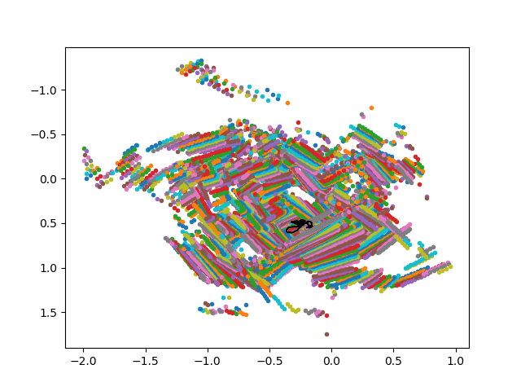

# DeepMapping: Unsupervised Map Estimation From Multiple Point Clouds
This repository contains PyTorch implementation associated with the paper:

"[DeepMapping: Unsupervised Map Estimation From Multiple Point Clouds](https://arxiv.org/abs/1811.11397)",
[Li Ding](https://www.hajim.rochester.edu/ece/lding6/) and [Chen Feng](https://ai4ce.github.io), 
CVPR 2019 (Oral).

<p align="center">



</p>

# Citation
If you find DeepMapping useful in your research, please cite:
```BibTex
@InProceedings{Ding_2019_CVPR,
author = {Ding, Li and Feng, Chen},
title = {DeepMapping: Unsupervised Map Estimation From Multiple Point Clouds},
booktitle = {The IEEE Conference on Computer Vision and Pattern Recognition (CVPR)},
month = {June},
year = {2019}
}
```

# Dependencies
Requires Python 3.x, [PyTorch](https://pytorch.org/), [Open3D](http://www.open3d.org/docs/introduction.html), and other common packages listed in ```requirements.txt```
```bash
pip3 install -r requirements.txt
``` 
Running on GPU is highly recommended. The code has been tested with Python 3.6.5, PyTorch 0.4.0 and Open3D 0.4.0

# Getting Started
## Dataset
Simulated 2D point clouds are provided as ```./data/2D/all_poses.tar```. Extract the tar file:
```bash
tar -xvf ./data/2D/all_poses.tar -C ./data/2D/
```
A set of sub-directories will be created. For example, ```./data/2D/v1_pose0``` corresponds to the trajectory 0 sampled from the environment v1. In this folder, there are 256 local point clouds saved in PCD file format. The corresponding ground truth sensor poses is saved as ```gt_pose.mat``` file, which is a 256-by-3 matrix. The i-th row in the matrix represent the sensor pose \[x,y,theta\] for the i-th point cloud.

## Solving Registration As Unsupervised Training
To run DeepMapping, execute the script 
```bash
./script/run_train_2D.sh
``` 
By default, the results will be saved to ```./results/2D/```.

### Warm Start
DeepMapping allows for seamless integration of a “warm start” to reduce the convergence time with improved performance. Instead of starting from scratch, you can first perform a coarse registration of all point clouds using incremental ICP
```bash
./script/run_icp.sh
```
The coarse registration can be further improved by DeepMapping. To do so, simply set ```INIT_POSE=/PATH/TO/ICP/RESULTS/pose_est.npy``` in ```./script/run_train_2D.sh```. Please see the comments in the script for detailed instruction.

## Evaluation
The estimated sensor pose is saved as numpy array ```pose_est.npy```. To evaluate the registration, execute the script
```bash
./script/run_eval_2D.sh
```
Absolute trajectory error will be computed as error metrics.
